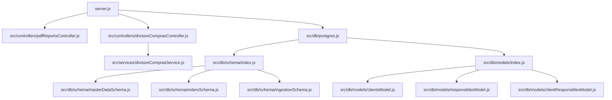
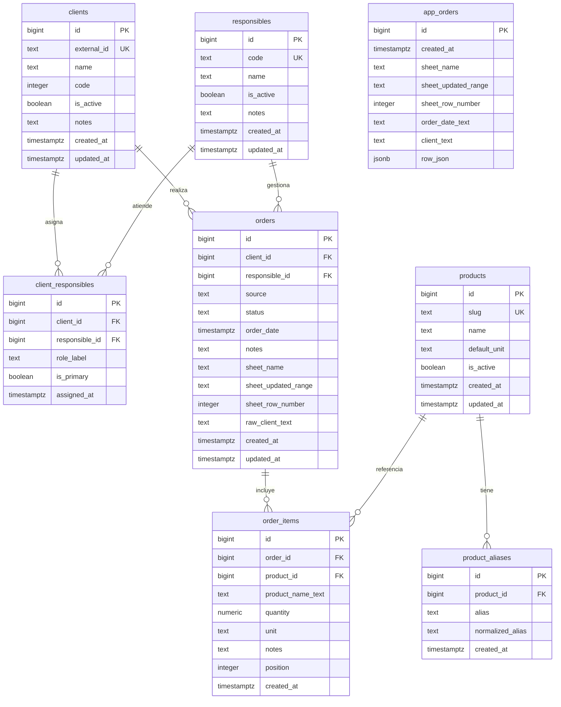

# Modularización backend y capa de datos

## Estructura de módulos

## Esquema de tablas (ER)

## Estado actual

- `app_orders` se mantiene para persistencia raw (compatibilidad con flujo actual).
- Se agregan tablas normalizadas para evolución por dominios (`clients`, `responsibles`, `orders`, `order_items`).
- Se agrega semilla inicial de responsables: Lucas, Miriam, Roberto, Beatriz, Pato.
- `server.js` ahora inicializa el esquema al arrancar y expone `app.locals.dbModels`.
